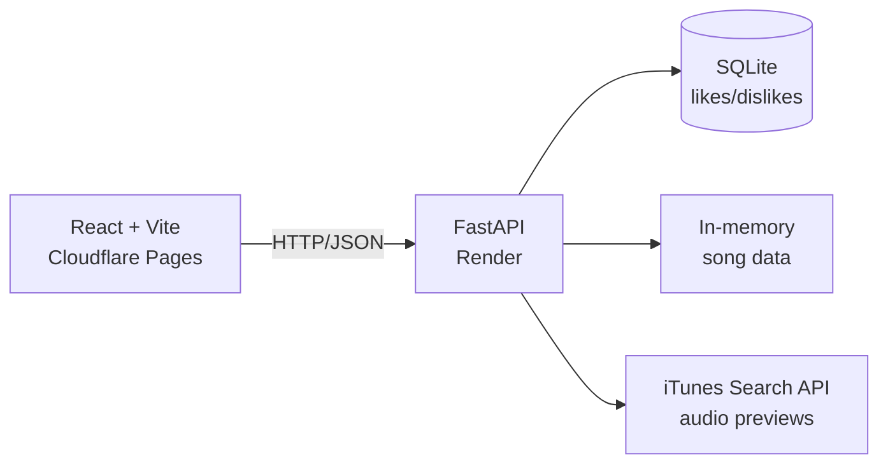

<div align="center">

# 🎵 Music Recsys

### A hybrid music recommendation engine — content-based + real collaborative filtering, no login required

[](https://music-recsys.pages.dev)
[](https://music-recsys.onrender.com)

[](https://react.dev)
[](https://vitejs.dev)
[](https://fastapi.tiangolo.com)
[](https://python.org)
[](https://sqlite.org)
[](https://pages.cloudflare.com)
[](https://render.com)

**[Live Site](https://music-recsys.pages.dev)** · **[API](https://music-recsys.onrender.com)** · **[Report a bug](https://github.com/tejasri3125/music-recsys/issues)**

</div>

---

## 📋 Table of contents

- [About](#-about)
- [Features](#-features)
- [How the recommender works](#-how-the-recommender-works)
- [Architecture](#-architecture)
- [Tech stack](#-tech-stack)
- [Getting started](#-getting-started)
- [Deployment](#-deployment)
- [Known limitations](#-known-limitations)
- [License](#-license)

---

## 📖 About

Music Recsys is a full-stack recommendation system built to demonstrate how content-based filtering and collaborative filtering combine into a real hybrid recommender — the same category of problem Spotify, Netflix, and YouTube solve at massive scale, built here at a portfolio scope with an honest accounting of what that scope can and can't do.

No sign-up, no password — each browser gets an anonymous identity, and the recommendations sharpen as you like and skip songs.

> ⚠️ The backend runs on Render's free tier and spins down after ~15 minutes of inactivity. An UptimeRobot monitor pings it every 14 minutes to keep it warm — if it's ever slow on first load, give it 30–60 seconds.

---

## ✨ Features

| | |
|---|---|
| 🎨 **Interactive landing page** | A music note built from hundreds of small dots that scatter from your cursor and spring back into shape |
| 🌗 **Dual theme** | Warm "Sunset Drive" glassmorphic design, dark and light modes |
| 🎯 **Real hybrid recommender** | Content-based cosine similarity blended with genuine collaborative co-occurrence filtering |
| 🔍 **Mood search** | Type *"upbeat songs for a workout"* — a local parser maps mood language to audio-feature filters, instantly, with zero external API dependency |
| 📚 **Full library browser** | Paginated, sortable view of the entire catalog |
| ▶️ **Live audio previews** | 30-second previews via the iTunes Search API |
| 🔒 **No login needed** | Anonymous per-browser identity via `localStorage`, powering personalization without accounts |
| 🛡️ **Security by default** | Parameterized SQL, input validation, rate limiting, security headers, locked-down CORS |

---

## 🧠 How the recommender works

**Content-based filtering**
Every song is a vector: `[danceability, energy, valence, normalized_tempo]`. Matches are ranked by cosine similarity:

```
sim(A, B) = (A · B) / (‖A‖ · ‖B‖)
```

**Collaborative filtering**
Instead of matrix factorization (which needs dense overlapping data most small apps don't have), this uses **co-occurrence**: find other anonymous sessions who liked the same songs as you, then surface what *they* liked that you haven't seen yet — weighted by frequency.

**The blend:**
```
final_score = 0.65 × content_score + 0.35 × collaborative_score
```

New users with no like history get a popularity-ranked cold-start feed instead of an empty page.

---

## 🏗 Architecture



---

## 🛠 Tech stack

**Frontend** — React 18 · Vite · React Router · hand-built CSS design system
**Backend** — FastAPI · Pydantic · NumPy · Pandas · SQLite
**External API** — iTunes Search (free, no auth)
**Hosting** — Cloudflare Pages · Render
**Dataset** — [Spotify Tracks Dataset](https://www.kaggle.com/datasets/maharshipandya/-spotify-tracks-dataset) (Kaggle)

---

## 🚀 Getting started

### Backend
```bash
cd backend
python -m venv venv
venv\Scripts\activate        # Windows
pip install -r requirements.txt
uvicorn app.main:app --reload --port 8000
```

### Frontend
```bash
cd frontend
npm install
npm run dev
```
Visit `http://localhost:5173`.

### Swapping the dataset
Drop a similarly-shaped CSV at `backend/app/data/spotify_tracks.csv` (needs `danceability`, `energy`, `valence`, `tempo`, `popularity`, plus title/artist columns — common naming variants are auto-detected). Restart the backend. Delete `backend/app/services/app_data.db` afterward, since song IDs shift and old likes would point at the wrong tracks.

---

## 🌐 Deployment

| Step | Command |
|---|---|
| Build frontend | `npm run build` |
| Deploy frontend | `wrangler pages deploy dist --project-name=music-recsys` |
| Backend build command | `pip install -r requirements.txt` |
| Backend start command | `uvicorn app.main:app --host 0.0.0.0 --port $PORT` |

Set `VITE_API_URL` in `frontend/.env.production` to your backend's URL **before** building — Vite bakes it in at build time, not runtime. Add your deployed frontend URL to `allow_origins` in `backend/app/main.py`, or CORS will block every request.

---

## ⚠️ Known limitations

- Collaborative filtering needs multiple real users with overlapping tastes to show its strength — with few testers, it leans on content-based scoring
- No formal evaluation (precision/recall, held-out testing) — recommendations are reasonable, not benchmarked
- SQLite suits a demo, not concurrent production writes at scale
- Identity is per-browser, not per-person — clearing storage resets a "user"

---

## 📄 License

Built as a portfolio project. Dataset: [Spotify Tracks Dataset](https://www.kaggle.com/datasets/maharshipandya/-spotify-tracks-dataset) on Kaggle, credit to maharshipandya.

<div align="center">

**[⬆ back to top](#-music-recsys)**

</div>
